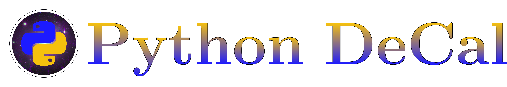

  

## Welcome to the Python DeCal Home Resources Page

Here you can find all relevant files to the course, all homeworks, workbooks, lecture slides, etc... for the Python DeCal: Introduction to Python Programming for Astronomers at UC Berkeley. The head instructor for this course is James Sunseri. The course website is <a href="pythondecal.github.io">pythondecal.github.io</a>.

### Current Instructors:
- James Sunseri
- Megan Joseph
- Ayla Weitz
- Emily Ma
- Raphael Baer-Way

### Previous Instructors
- Yilun Ma
- Wendy Wu

### Current Interns
- Claire Chen
- Annie McCutcheon
- Mahum Khan

### Faculty Sponsor
- Eugene Chiang

Note that most materials are adapted from previous instructors of the Python DeCal, Physics 77, and CS61A. We are creating what we believe to be the most useful resources and problem sets for learning how to use python in a scientific setting. In this course students learn a wide range of topics in scientific programming. We cover the basics of python, several libraries such as numpy, scipy, pandas, matplotlib, astropy, etc..., numerical methods for ODE solving and calculus, animation, and some professional development as well. Our goal is for the students to leave the course having a sense of confidence in their programming abilities for any academic setting including course work and research. Students finish the course with a mandatory final project. These final projects cover a wide range of topics primarily in astronomy but not limited to the field. Previous projects have involved simulating the solar system, simulating eclipsing binary stars and their light curves, animating isochrones from theoretical stellar models, creating HR Diagrams of globular clusters, simulating nbody galaxies, etc...

